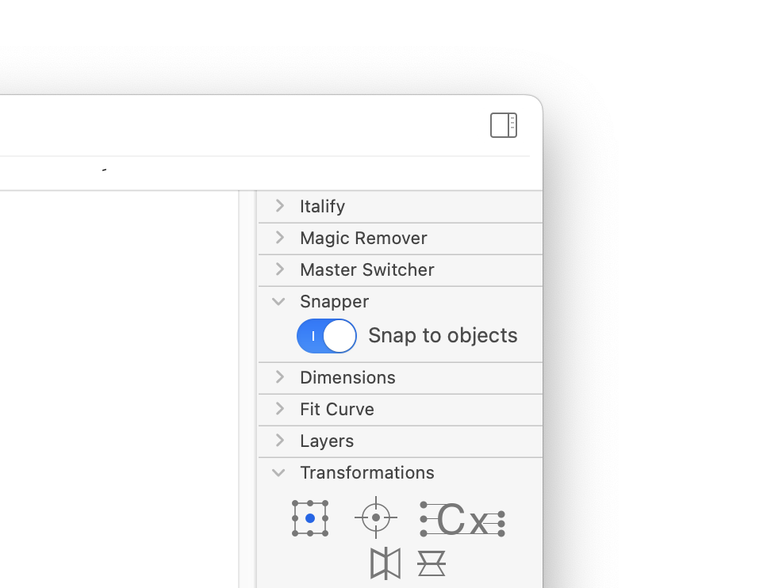

# Snapper palette

Palette plug-in for the Glyphs.app font editor for toggling object snapping for the current font.

Clicking the button is equivalent to setting `Glyphs.font.snapToObjects` in case that tells you anything.

### Installation

1. One-click install *Snapper* from *Window > Plugin Manager > Plugins*
2. Restart Glyphs.

### System Requirements

The plug-in requires any version of Glyphs&nbsp;3, and at least macOS&nbsp;10.15.

### License

Copyright 2022 Rainer Erich Scheichelbauer (@mekkablue).
Based on sample code by Georg Seifert (@schriftgestalt) and Jan Gerner (@yanone).

Licensed under the Apache License, Version 2.0 (the "License");
you may not use this file except in compliance with the License.
You may obtain a copy of the License at

http://www.apache.org/licenses/LICENSE-2.0

See the License file included in this repository for further details.
